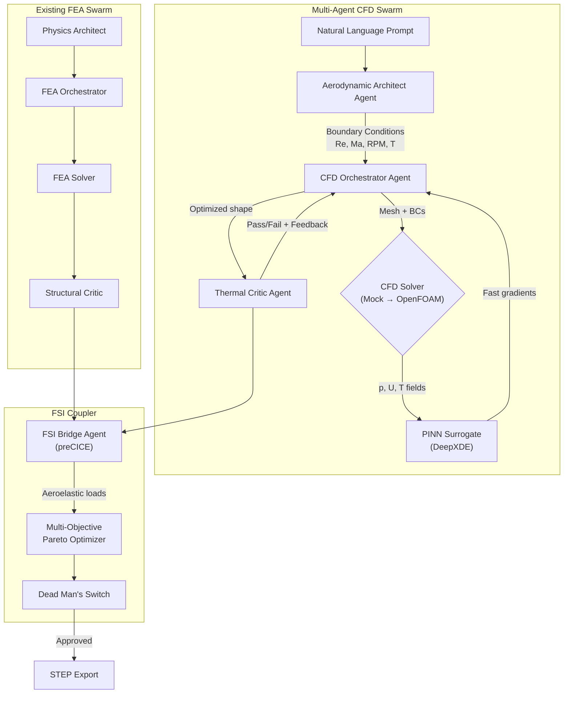

# CFD Multi-Agent Swarm for Turbine Blade Aero-Thermal Optimization

Extend the existing [optimization_swarm.py](file:///c:/Users/wiece/OneDrive/Desktop/FaradayX/CAD-Expert/turbines_test/optimization_swarm.py) FEA topology optimization framework to include **Computational Fluid Dynamics (CFD)**—aerodynamic shape optimization, conjugate heat transfer (CHT), and fluid-structure interaction (FSI)—using the same multi-agent swarm architecture.

---

## Top 10 Literature Foundation

The following papers/research programs form the technical basis for this plan. They are grouped by the capability they unlock.

### Group A — Adjoint-Based Aerodynamic Shape Optimization

| # | Paper / Project | Key Contribution | Relevance |
|---|----------------|-------------------|-----------|
| **1** | **DAFoam: Discrete Adjoint for OpenFOAM** (He et al., AIAA 2024) | Open-source discrete adjoint built on OpenFOAM. Supports RANS (k-ω SST), automatic differentiation, and integration with OpenMDAO/MACH-Aero. | **Our primary CFD gradient engine.** Provides efficient ∂J/∂X sensitivities for 100k+ design variables without finite differencing. |
| **2** | **SU2: Continuous Adjoint for Turbomachinery** (Pini et al., PoliMi 2024) | 3D RANS adjoint for compressor/turbine rotors with sweep, lean, and endwall contouring. | Backup solver; validates DAFoam results against independent adjoint formulation. |
| **3** | **Tailored Mesh Adaptation for Adjoint-Based ASO** (TUM/DTU, TORQUE 2024) | Reports >8× speed-up in adjoint optimization by adaptive mesh refinement near shock/boundary-layer regions. | Directly applicable to our mesh strategy—avoids over-refining the lattice interior. |

### Group B — Neural Surrogates & Physics-Informed Models

| # | Paper / Project | Key Contribution | Relevance |
|---|----------------|-------------------|-----------|
| **4** | **PINN Surrogate for Turbulated Cooling Channels** (EPFL, 2024) | PINNs (via DeepXDE) trained on Navier-Stokes + energy equation to predict Nu and ΔP across pin-fin/rib geometries. Reduces CFD eval from hours to milliseconds. | **Our "fast-lane" evaluator.** During gradient descent, the PINN surrogate replaces full CFD for intermediate iterations. |
| **5** | **Multi-Fidelity ANN Surrogates for Turbine Blade Aerodynamics** (PoliMi/ResearchGate, 2024) | Combines coarse-mesh RANS (low-fidelity) with fine-mesh LES (high-fidelity) data to train a multi-fidelity neural network. | Architecture for our "Predictive Agent"—trains on cheap OpenFOAM runs, validates with expensive runs. |
| **6** | **PINN-MRT: Lattice Boltzmann + Neural Network** (MDPI, 2025) | Embeds kinetic theory (Multi-Relaxation-Time LBM) into PINNs for high-Re flow stability. | Fallback for Re > 10⁶ regimes where standard PINNs struggle with convergence. |

### Group C — Conjugate Heat Transfer Topology Optimization

| # | Paper / Project | Key Contribution | Relevance |
|---|----------------|-------------------|-----------|
| **7** | **CHT Topology Optimization for Gas Turbine Guide Vanes** (MDPI/Diva-Portal, 2026) | Compares Stokes vs. RANS-based CHT topology optimization using OpenFOAM. RANS captures recirculation zones that Stokes misses entirely. | **Core methodology for internal cooling channel design.** We adopt their density-based TO + CHT formulation. |
| **8** | **Density-Based TO for Double-Wall Cooling Pin-Fins** (GPPS-TC-2024-0005) | Explores how initial design configurations (161 impingement-fin-film layout) affect TO convergence. "Tadpole-shaped" spoilers reduce low-velocity wake regions. | Informs our initial seed geometry for the lattice optimizer. |

### Group D — Multi-Agent & Autonomous CFD Frameworks

| # | Paper / Project | Key Contribution | Relevance |
|---|----------------|-------------------|-----------|
| **9** | **TurboAgent: LLM-Driven Multi-Agent CFD Framework** (arXiv, 2025) | Autonomous multi-agent system with Generative, Predictive, and Orchestration agents. Natural-language to CFD pipeline. Reduces design cycle from weeks to hours. | **Direct architectural inspiration.** Our swarm mirrors their agent topology but adds the Dead Man's Switch for safety. |
| **10** | **Foam-Agent / NL2FOAM: LLM-to-OpenFOAM Automation** (GitHub/Sciety, 2025) | LLM translates natural language into OpenFOAM case dictionaries (fvSchemes, fvSolution, boundary conditions). Includes CFDLLMBench for evaluation. | **Our "CFD Setup Agent."** Generates `system/controlDict`, `constant/polyMesh`, and `0/` boundary files automatically. |

### Group E — Fluid-Structure Interaction

| # | Bonus | Key Contribution | Relevance |
|---|-------|-------------------|-----------|
| **B1** | **preCICE: Solver-Agnostic FSI Coupling** (TUM, 2024 Workshop) | Partitioned coupling between OpenFOAM (fluid) and FEniCS (structure). Handles mesh motion, data mapping, and convergence acceleration. | **Bridges our existing FEA solver with the new CFD solver.** Enables aeroelastic + thermal coupling. |

---

## User Review Required

> [!IMPORTANT]
> **Solver Installation**: OpenFOAM does not run natively on Windows. The plan assumes using **WSL2 + Docker** (DAFoam provides official Docker images). All Python orchestration runs on Windows; only the CFD solver executes inside WSL2/Docker. Is this acceptable?

> [!WARNING]
> **Compute Budget**: A single RANS CFD evaluation of the turbine blade takes ~10–30 minutes on 4 cores. The PINN surrogate reduces this to milliseconds for intermediate iterations, but initial dataset generation (50–100 CFD runs) will require ~8–50 hours of compute. Do you want to start with a **mock CFD solver** (like we did for FEA) and swap in real OpenFOAM later?

> [!CAUTION]
> **Multi-Objective Tradeoff**: Adding aerodynamic efficiency as an objective creates a Pareto front against mass reduction. The optimizer may suggest denser (heavier) lattice configurations that improve airflow but reduce mass savings. The Dead Man's Switch will visualize this tradeoff, but the user must define priority weights.

---

## Open Questions

1. **Solver Priority**: Should we start with a **mock CFD solver** (analytical Bernoulli/Euler equations for pressure distribution, empirical Nusselt correlations for heat transfer) and graduate to real OpenFOAM? This mirrors the approach we took for FEA.

2. **Objective Weights**: What relative importance should the optimizer assign?
   - Mass reduction (current objective): weight `w₁`
   - Aerodynamic efficiency (lift-to-drag ratio): weight `w₂`  
   - Thermal performance (max surface temperature): weight `w₃`
   - Suggested default: `w₁ = 0.4, w₂ = 0.35, w₃ = 0.25`

3. **Design Space**: Should we optimize:
   - (a) External blade shape (airfoil profile, twist, chord) — requires adjoint CFD
   - (b) Internal cooling channels only — requires CHT topology optimization
   - (c) Both simultaneously — requires coupled FSI loop

---

## Proposed Architecture



---

## Proposed Changes

### CFD Agent Core

---

#### [NEW] [cfd_solver.py](file:///c:/Users/wiece/OneDrive/Desktop/FaradayX/CAD-Expert/turbines_test/cfd_solver.py)
The CFD physics solver, mirroring the structure of the existing [physics_solver.py](file:///c:/Users/wiece/OneDrive/Desktop/FaradayX/CAD-Expert/turbines_test/physics_solver.py):

- **`MockCFDSolver`** (Phase 1): Analytical approximations using:
  - Bernoulli equation for pressure distribution along the blade surface
  - Blasius boundary layer theory for skin friction drag
  - Empirical Nusselt correlations (Dittus-Boelter) for internal cooling heat transfer
  - Euler's turbomachine equation for work extraction: $W = U(C_{θ2} - C_{θ1})$
  
- **`OpenFOAMCFDSolver`** (Phase 2 — future): WSL2/Docker bridge to headless OpenFOAM via `subprocess`:
  - Generates `system/controlDict`, `constant/transportProperties`, `0/U`, `0/p`, `0/T`
  - Runs `simpleFoam` (incompressible RANS) or `buoyantSimpleFoam` (CHT)
  - Parses `postProcessing/` output for force coefficients and Nusselt numbers

- **`DAFoamAdjointSolver`** (Phase 3 — future): Full adjoint-based shape optimization via DAFoam + OpenMDAO

**Key methods:**
```python
class MockCFDSolver:
    def compute_pressure_distribution(self, blade_profile, inlet_velocity, rpm) -> dict
    def compute_heat_transfer(self, internal_channel_geometry, coolant_temp, hot_gas_temp) -> dict
    def compute_aerodynamic_efficiency(self, lift, drag) -> float
    def compute_gradients(self, design_params) -> np.ndarray  # Numerical gradients
```

---

#### [NEW] [cfd_optimization_swarm.py](file:///c:/Users/wiece/OneDrive/Desktop/FaradayX/CAD-Expert/turbines_test/cfd_optimization_swarm.py)
The CFD-specific multi-agent swarm, following the same pattern as [optimization_swarm.py](file:///c:/Users/wiece/OneDrive/Desktop/FaradayX/CAD-Expert/turbines_test/optimization_swarm.py):

- **`AerodynamicArchitectAgent`**: Translates NL prompt into CFD boundary conditions:
  - Inlet Mach number, Reynolds number, total temperature/pressure
  - Blade row geometry: pitch, chord, stagger angle
  - Turbulence model parameters (k-ω SST constants)

- **`CFDOrchestratorAgent`**: Runs the shape optimization loop:
  - Parameterizes the blade surface using B-spline control points (Bézier curves)
  - Computes aerodynamic objective: $J = C_L / C_D$ (lift-to-drag ratio)
  - Thermal objective: $J_T = \max(T_{surface}) < T_{limit}$
  - Uses numerical gradients (Phase 1) or adjoint gradients (Phase 3)

- **`ThermalCriticAgent`**: Validates CHT results:
  - Checks max surface temperature against Inconel 718 creep limit
  - Validates cooling channel pressure drop against available coolant supply pressure
  - Ensures no flow separation or recirculation in critical regions

- **`FSIBridgeAgent`**: Couples CFD results with existing FEA:
  - Maps aerodynamic pressure loads → structural FEA boundary conditions
  - Maps thermal field → structural thermal expansion
  - Computes aeroelastic deflection feedback

---

#### [MODIFY] [optimization_swarm.py](file:///c:/Users/wiece/OneDrive/Desktop/FaradayX/CAD-Expert/turbines_test/optimization_swarm.py)
Add integration hooks for the CFD swarm:

- Import `CFDOptimizationSwarm` and add a `--mode` CLI flag:
  - `--mode fea` (default, current behavior)
  - `--mode cfd` (new CFD-only optimization)
  - `--mode coupled` (full FEA + CFD multi-objective)
- Extend `DeadMansSwitch` to display aerodynamic telemetry (Cp distribution, Nusselt number, temperature contours) alongside structural data

---

#### [NEW] [cfd_swarm_guide.md](file:///c:/Users/wiece/OneDrive/Desktop/FaradayX/CAD-Expert/turbines_test/cfd_swarm_guide.md)
Documentation covering:
- Literature review summary (papers 1–10 above)
- Mathematical formulations for each CFD agent
- Setup guide for OpenFOAM via WSL2/Docker (Phase 2)
- PINN surrogate training procedure (Phase 3)

---

## Implementation Phases

### Phase 1: Mock CFD Solver + Agent Skeleton (This PR)
- Build `MockCFDSolver` with analytical aerodynamic/thermal models
- Build all 4 new agent classes with the mock solver
- Integrate with existing `DeadMansSwitch`
- Multi-objective Pareto visualization in terminal
- **Estimated effort**: 1–2 sessions

### Phase 2: Real OpenFOAM Integration (Future)
- WSL2/Docker bridge for headless OpenFOAM execution
- Automated mesh generation (snappyHexMesh from STEP geometry)
- CHT solver (buoyantSimpleFoam) for internal cooling analysis
- **Estimated effort**: 2–3 sessions

### Phase 3: Adjoint + PINN Acceleration (Future)
- DAFoam integration for discrete adjoint gradients
- DeepXDE PINN surrogate training on OpenFOAM dataset
- preCICE FSI coupling between OpenFOAM and FEniCS
- **Estimated effort**: 3–5 sessions

---

## Verification Plan

### Automated Tests
```bash
# Phase 1: Run mock CFD swarm
python turbines_test/cfd_optimization_swarm.py --auto-approve

# Run coupled mode
python turbines_test/optimization_swarm.py --mode coupled --auto-approve
```

### Manual Verification
- Verify that the `AerodynamicArchitectAgent` correctly parses NL prompts into CFD boundary conditions
- Confirm the mock CFD solver produces physically reasonable pressure/temperature distributions (compare against published NACA airfoil data)
- Validate that the `ThermalCriticAgent` correctly identifies safety violations
- Inspect the multi-objective Pareto front visualization in the Dead Man's Switch
- Verify exported JSON contains both structural and aerodynamic optimization results
