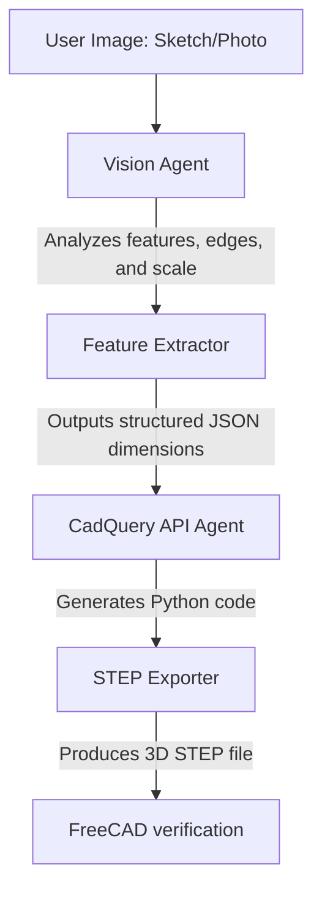

# Image to CAD — Vision-Driven Generative CAD Skill

This skill defines the multi-agent orchestration loop for converting 2D images (hand-drawn sketches, technical drawings, or photos of mechanical parts) into parametric, executable CadQuery scripts using local vision models.

---

## Orchestration Loop

### Steps of Execution

1. **Visual Analysis (Vision Agent)**:
   - Run the user's input image through a local multimodal model (e.g., `qwen2.5-vl` or `minicpm-v`).
   - The model identifies primary shapes (primitives like cylinders, boxes, flanges) and spatial relationships.
2. **Feature Extraction**:
   - The agent translates visual elements into key parameters: bounding dimensions, hole diameters, and extrusion thicknesses.
3. **Script Generation**:
   - The `Agent_CadQuery_API` writes a CadQuery script utilizing the parameters extracted in Step 2.
4. **Verification & Mesh Loading**:
   - The script is executed to output a STEP file, which is loaded into FreeCADCmd for topological safety checks.

---

## Model Selection for Vision Tasks

Since vision models require more VRAM, ensure the local Ollama stack is configured to run one model at a time:

| Task Type | Recommended Model | Context Cap | VRAM Usage |
|---|---|---|---|
| Hand sketches, simple shapes | `minicpm-v:latest` | 2048 | ~2.2 GB |
| Technical blueprints, complex assemblies | `qwen2.5-vl:7b` | 4096 | ~4.8 GB |
