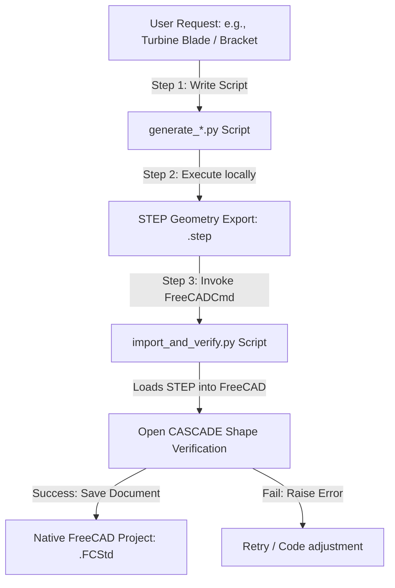

# Turbine & Zero-To-CAD Generation Workflow

This directory contains the outputs and custom scripts for generating complex CAD models using **Route B (CadQuery Pipeline)**.

---

## 🔄 Workflow Diagram

---

## 📂 File Explanations

### 1. Generation Scripts
- **`generate_turbine_blade.py`**: Builds the custom aerofoil turbine blade by twisting and lofting 3 cross-section profiles along a 120mm Z-axis span.
- **`generate_zero_to_cad_bracket.py`**: An example extracted directly from the Zero-To-CAD-1m dataset to build a reinforced mounting bracket.

### 2. Geometry Output
- **`*.step`**: The standard boundary-representation (B-REP) 3D file exported from CadQuery.
- **`*.FCStd`**: The final verified native FreeCAD project file. Double-click this file to open it directly in the FreeCAD desktop GUI.

### 3. Verification Log
- **`import_verify_log.txt`**: Logs the shape metrics (volume, surface area, face count, edge count) and verifies that the model is manifold and free of self-intersections.
